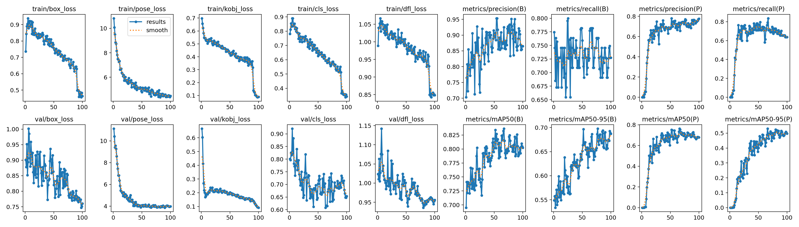
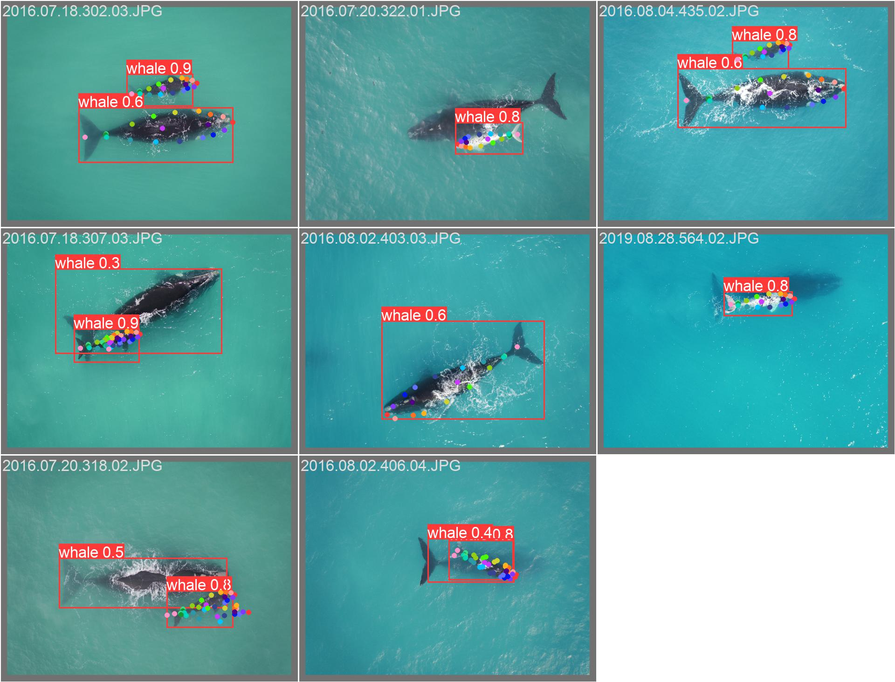

# Save-The-Whales

## Training Statistics

## Results
These are the initial results on the validation set.

Currently, Working on improving the results by reducing the pose_loss by adding more date augmentation and more epochs to the training to make the model robust enough to detect the key points on whales of different orientations at test times.

Also, working on developing a human-in-the-loop system to help human annotators to correct the model predictions to help the model to train better and align better.
